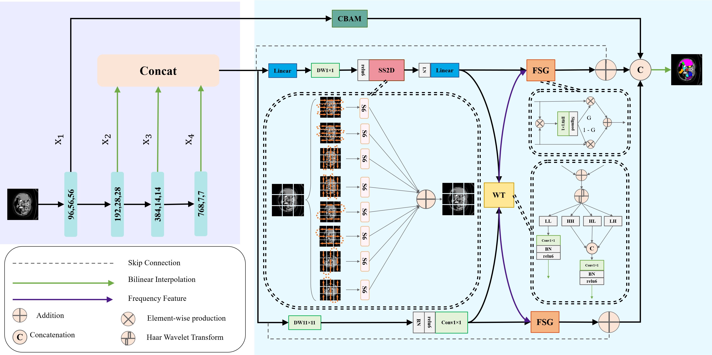

# VMDFSD

This repository is the official implementation of VMDFSD :VMmaba-DFSD: Dual-domain Frequency-Spatial  Decoder for Medical image segmentation




## Main Environments

```
conda create -n vmdfsd python=3.10
conda activate vmdfsd
pip install torch==1.13.0 torchvision==0.14.0 torchaudio==0.13.0 --extra-index-url https://download.pytorch.org/whl/cu117
pip install timm==0.4.12 fvcore PyWavelets triton==2.1.0 thop scikit-learn  thop h5py SimpleITK scikit-image medpy yacs numpy==1.26.4
pip install causal_conv1d-1.0.0+cu118torch2.2cxx11abiFALSE-cp310-cp310-linux_x86_64.whl
pip install mamba_ssm-1.0.1+cu118torch2.2cxx11abiFALSE-cp310-cp310-linux_x86_64.whl
cd kernels/selective_scan
pip install .
```
[causal_conv1d-releases](https://github.com/Dao-AILab/causal-conv1d/releases)\
[mamba_ssm-releases](https://github.com/state-spaces/mamba/releases/)


 


## Datasets

Please download the datasets and put them in the `./data/` folder.

| Dataset     | GitHub Repository                                                 | Google Drive Link                                                                                   | Baidu Netdisk (All)                                                                 |
|-------------|-------------------------------------------------------------------|------------------------------------------------------------------------------------------------------|------------------------------------------------------------------------------------|
| **ISIC**    | [GitHub](https://github.com/JCruan519/VM-UNet)                   | [Google Drive](https://drive.google.com/file/d/1XM10fmAXndVLtXWOt5G0puYSQyI2veWy/view)               | [Baidu Netdisk](https://pan.baidu.com/s/1MQEcSFNne-UNdiaHTOI2rw) (Password: z123) |
| **US30K**   | [GitHub](https://github.com/xianlin7/SAMUS)                      | [Google Drive](https://drive.google.com/file/d/13MUXQIyCXqNscIKTLRIEHKtpak6MJby_/view)              | Same as above                                                                     |
| **Synapse** | [GitHub](https://github.com/Beckschen/TransUNet)                 | [Google Drive](https://drive.google.com/drive/folders/1ACJEoTp-uqfFJ73qS3eUObQh52nGuzCd)            | Same as above                                                                     |


## Pretrained Models

### 1. Vmamba Pretrained Weights
These are the **Vmamba backbone pretrained weights**, used for initializing the model **before fine-tuning on specific datasets**.  
Please download them and place them in the `./pre/` folder.

| Resource        | Link                                                                                       |
|-----------------|--------------------------------------------------------------------------------------------|
| **GitHub**      | [Releases](https://github.com/MzeroMiko/VMamba/releases)                                   |
| **Google Drive**| [Download](https://drive.google.com/file/d/1AJ65V7U49u8RJekxbpeSUmI6xqkyvsLb/view?usp=drive_link) |
| **Baidu Netdisk** | [Download](https://pan.baidu.com/s/1MQEcSFNne-UNdiaHTOI2rw) (Password: z123)                  |

### 2. Dataset-specific Weights
These are the **model weights trained on specific datasets**.  
Please download them and place them in the `./pth/` folder.

| Resource          | Link                                                                                       |
|-------------------|--------------------------------------------------------------------------------------------|
| **Google Drive**  | [Download](https://drive.google.com/drive/folders/1-oyT-8XoxN9G3na4p-jP_HfXXTnbmtph?usp=sharing) |
| **Baidu Netdisk** | [Download](https://pan.baidu.com/s/1MQEcSFNne-UNdiaHTOI2rw) (Password: z123)                  |

## Evaluate the Model

After preparing the datasets and pretrained weights, run the evaluation:

```
 ./0_load_model.sh 
```
## Train the Model
```
python  syn_mytrain.py --name "base" 
```
## Acknowledgments

We thank the authors of the following open-source projects for their inspiring code :

- [VMamba](https://github.com/MzeroMiko/VMamba)
- [VM-UNet](https://github.com/JCruan519/VM-UNet) 
- [TransUNet](https://github.com/Beckschen/TransUNet) 
- [CCViM](https://github.com/zymissy/CCViM)
- [WTConv](https://github.com/BGU-CS-VIL/WTConv) 
- [EMCAD](https://github.com/SLDGroup/EMCAD) 
- [DAC-Net](https://github.com/Phil-y/DAC-Net) 